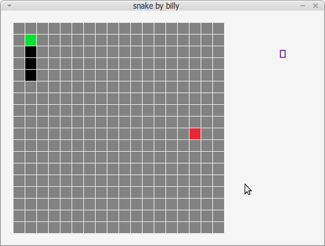

# Snake Raylib

Using template from [raylib-cpp-starter](https://github.com/CapsCollective/raylib-cpp-starter).

Continuation from [tetris_raylib](https://github.com/billymosis/tetris_raylib).

This is my attempt to create snake game from scratch with help from raylib graphic library.

I recreate this from scratch so there will be inefficient here and there.

This getting me to love C++ more but I also curious about RUST game Engine that's called [Bevy](https://bevyengine.org/).
I think next I will continue using raylib and trying the 3d capabilities.


## Build and Run

I only do this on Ubuntu/Linux Mint

### Linux

```
$ make setup
$ make

```
